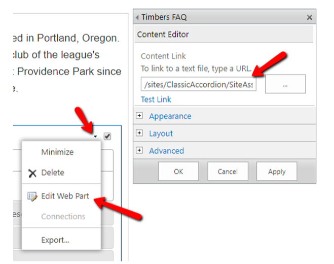

# jQuery-Accordion-Section
Collapsible Accordion Section designed to be added to SharePoint page using a CEWP (Content Editor Web Part) in order to display list data in accordion format

## SPFx Collapsible Accordion Section web part

* Adds a collapsible accordion to a page.
* Populate the accordion structure from a List on your site. 
* The list used to populate the accordion section must have a Title column and Content column & its name specified in the REST API in the code before deploying.

## Applies to

* SharePoint 2013
* SharePoint 2016
* Office 365 SharePoint (Classic Sites only) - not recommended, however.  Please see 

## Solution

Solution|Author(s)
--------|---------
jQuery Collapsible Accordion Section|Erik Benke

## Version history

Version|Date|Comments
-------|----|--------
1.0|June 27, 2018|Initial release
1.1|September 19, 2019|Minor updates, adding to Github

### Using the code

**1) Create or use a list with a Title and a Content column:**
* The value in the Title column for each item will appear in the heading bars of the Accordion.  
* The value in the Content column for each item will appear in the collapsible content section of the Accordion    

**2) Add the .html file, jQuery library, jQueryUI library and css to your Site Assets folder on your site**  

**3) Add a Content Editor Web Part (CEWP) to your page:**

**4) Configure the Content Editor Web Part (CEWP) to point to the code entry file:**
Choose Edit Web Part and then within the Content Link field add the path of your entry file for your code:
Example of a full path: /sites/ClassicAccordion/SiteAssets/ClassicAccordion.html

